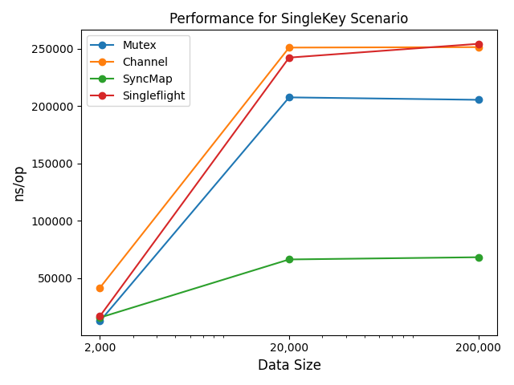

# 傳遞 message 來撰寫程式, 在 golang 應該如何思考

實現一個 簡易的 cache proxy  
藉由 concurrency 的情景, 提供數種程式的撰寫方式

## 打廣告  

待業中, 正在尋求工作  
有近三年的純軟工作經驗，主要擔任後端工程師  
以下是我的履歷  

[Resume](https://www.cakeresume.com/s---I2gzAabWYpPT5LQogCd3g--/ch_caesar)

## slide

v2:  
2023-04-25 go meetup 所使用的 slide  
<https://docs.google.com/presentation/d/1BKdpu8wF9zqpoGQrjQW6QmzOVIKwwwz6I96lvoMEPPg>

v0:  
內容分散, 關注太多細節, 程式碼凌亂  
~~<https://docs.google.com/presentation/d/1yctNKOoct49OEj7jZtKfVjrnZifABWbWxfpJ3MM2D9w>~~

v0 相關程式  
<https://github.com/KScaesar/cache-proxy-demo/tree/v0.1.0>

## youtube 演講影片

[](https://youtu.be/gwZhQiHcJlQ?t=1898)

## cache proxy implimentation

[base proxy](./cache_proxy.go)

- [global lock proxy](./mutex_proxy.go)
- [channel proxy](./channel_proxy.go)
- [shard lock proxy](./syncMap_proxy.go)
- [singleflight proxy](./singleflight_proxy.go)


## benchmark

goos: linux  
goarch: amd64  
cpu: Intel(R) Core(TM) i7-6700HQ CPU @ 2.60GHz

---

SingleKey:  
data size = X, 共有 X 個 key  
循序查詢不同 key  
同一個 key, 同時有 N 個請求

MultiKey:  
data size = X, 共有 X 個 key  
併發 b.N 個請求, 查詢不同 key  
同一個 key, 同時有 N 個請求

| Performance for SingleKey Scenario                        | Performance for MultiKey Scenario                      |
|-----------------------------------------------------------|--------------------------------------------------------|
|  |  |

- 隨著數據量的增加，性能都會變得更差，但 Mutex 的性能下降比較明顯
- 不管是在 SingleKey 還是 MultiKey 的情況下，使用 SyncMap 的效率都有不錯的表現
- Channel 在 SingleKey 的情況下性能較差，但在 MultiKey 的情況下性能有顯著提升
- 在 MultiKey 隨著資料量增加，Channel 的效能優勢逐漸明顯，在大量資料使用 Channel 進行併發處理，可能是一個較好的選擇

---


SingleKey

```
# single key: data size: 2e3
BenchmarkMutexProxy-8         96925       12625 ns/op
BenchmarkChannelProxy-8       27174       41798 ns/op
BenchmarkSyncMapProxy-8       73860       15768 ns/op
BenchmarkSingleflightProxy-8  63872       17039 ns/op

# single key: data size: 2e4
BenchmarkMutexProxy-8         5845      207748 ns/op
BenchmarkChannelProxy-8       4678      251148 ns/op
BenchmarkSyncMapProxy-8      17397       66449 ns/op
BenchmarkSingleflightProxy-8  4838      242412 ns/op

# single key: data size: 2e5
BenchmarkMutexProxy-8         5563      205604 ns/op
BenchmarkChannelProxy-8       4706      251540 ns/op
BenchmarkSyncMapProxy-8      16418       68377 ns/op
BenchmarkSingleflightProxy-8  4524      254424 ns/op
```

---

MultiKey

```
# multi key: data size: 2e2
BenchmarkMutexProxy-8         122713        9026 ns/op
BenchmarkChannelProxy-8        54196       19094 ns/op
BenchmarkSyncMapProxy-8       188413        6556 ns/op
BenchmarkSingleflightProxy-8  116383       11600 ns/op

# multi key: data size: 2e4
BenchmarkMutexProxy-8          3702      315541 ns/op
BenchmarkChannelProxy-8       72529       16734 ns/op
BenchmarkSyncMapProxy-8       77472       15004 ns/op
BenchmarkSingleflightProxy-8  49404       22518 ns/op

# multi key: data size: 2e5
BenchmarkMutexProxy-8          3146      320547 ns/op
BenchmarkChannelProxy-8       38979       33913 ns/op
BenchmarkSyncMapProxy-8       29878       38783 ns/op
BenchmarkSingleflightProxy-8  12837       98216 ns/op
```

## 關於我

有問題討論, 可發 issue, 或用下方的聯絡方式

Email:  
x246libra@hotmail.com

Telegram id:  
@ksCaesar

## reference

1.[Go语言圣经中文版 - 9.7. 示例: 并发的非阻塞缓存](https://github.com/gopl-zh/gopl-zh.github.com/blob/master/ch9/ch9-07.md?fbclid=IwAR0sVeVwXrDVxT0Ozh0vcSTxVJV-scl_ZA-vCDFkJE9HqiyRBDkSrnOpWc8)  
2.[Messaging Patterns - Return Address](https://www.enterpriseintegrationpatterns.com/patterns/messaging/ReturnAddress.html)  
4.[sync.Map的LoadOrStore用途](https://xnum.github.io/2018/11/syncmap-loadorstore/)  
6.[sync.singleflight 到底怎么用才对？](https://www.cyningsun.com/01-11-2021/golang-concurrency-singleflight.html)  
8.[Hardware Memory Models](https://research.swtch.com/hwmm)  
9.[How Does Golang Channel Works](https://levelup.gitconnected.com/how-does-golang-channel-works-6d66acd54753)  
10.[Mutex Or Channel](https://github.com/golang/go/wiki/MutexOrChannel)  
